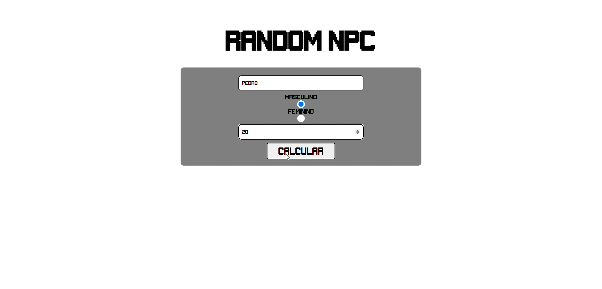

# Random NPC

    <a href='#descrição'>Descrição</a> -
    <a href='#tecnologias'>Tecnologias</a> -
    <a href='#imagens'>Imagens</a> -
    <a href='#sobre'>Sobre</a>

## Descrição

O Random NPC, é um aleatorizador de personagem. É necessário inserir algumas características prévias e o programa realiza a aleatorização das caracteristicas restantes do personagem. Sorteando um valor de 1(um) a 7(sete) pecados capitais e escolhendo esse número dentre os pecados capitais possíveis no programa.

## Tecnologias

* HTML
* CSS
* JavaScript

## Imagens

<h3 align='center'>

Tela Inicial

</img>

Iserindo as Características Básicas do Personagem

</img>

Resultado Final Aleatorizado do Personagem no Campo em Vermelho

</img>
</h3>

## Sobre

Usei um back-end básico apenas para me ajudar a desenvolver, back-end com Node.js

  

Made with by Math.js [Veja Meu LinkedIn](https://www.linkedin.com/in/matheus-de-sousa-ferreira-227376214
)